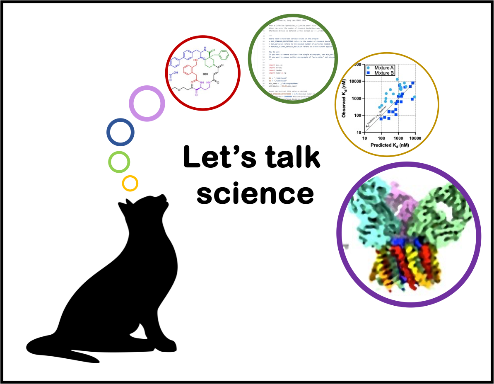

     

     	  My PhD mentor, Dr. Markus Seeliger, has given me the opportunity to work with some [terrific groups](./Projects) and has shown me what collaborative science can generate. I've developed skills at the interface of biochemistry and computational biology and I speak both languages. Send me a line if you would like to talk science.      
          Get in touch: ian.outhwaite[at]stonybrookmedicine.edu   
	  Or find out more with:         
	  Orcid: <a href = "https://orcid.org/0000-0003-2037-3261"> 0000-0003-2037-3261 </a>   
	  LinkedIn: <a href = "https://www.linkedin.com/in/ian-outhwaite"> ian-outhwaite </a>  
	  Github: <a href = "https://github.com/iouthwaite"> iouthwaite </a>
     

     

          
     

